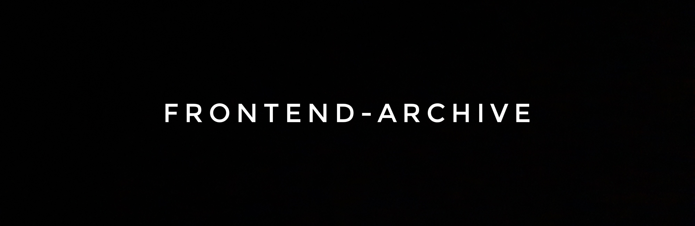

# Archived Projects

A collection of frontend projects created to reinforce my understanding of user interface design, web architecture, and interactive behavior. As I progressed, I added my own touches to each project and explored more advanced ideas with every new challenge.

## Live Links

 

| No. | Project                         | Description                                                        | Live Demo                    |
|-----|---------------------------------|--------------------------------------------------------------------|------------------------------|
| 01  | [Digital Business Card](./business-card-of-mona-lisa)           | A digital business card design.                                    | [Live Demo](https://mona-lisa-business-card.vercel.app)     |
| 02  | [Space Exploration Site](./Space-Exploration)         | A site about space exploration.                                    | [Live Demo](https://space-exploration-tau.vercel.app)     |
| 03  | [Birthday GIFt Site](./birthday-GIFt)                 | A personalized birthday gift site wrapped in emojis.               | [Live Demo](https://birthday-gif-t.vercel.app)     |
| 04  | [Home Town Home Page](./hometown-homepage)              | A homepage showcasing your hometown.                               | [Live Demo](https://hometown-home-page.vercel.app)     |
| 05  | [Click Fund](./click-fund-counter-alternative)                                 | A simple app where users click to add a dollar.                    | [Live Demo](https://click-fund-app.vercel.app)     |
| 06  | [Score Board](./football-score-card)                               | A live scoreboard to track goals and fouls.                        | [Live Demo](https://el-clasico-scoreboard.vercel.app)     |
| 07  | [Blackjack Game](./Blackjack)                         | A digital version of Blackjack.                                    | [Live Demo](https://black-jack-liart.vercel.app)     |
| 08  | [MyPass](./Password-Generator)                                         | A random password generator with customizable length.              | [Live Demo](https://my-pass-liard.vercel.app)     |
